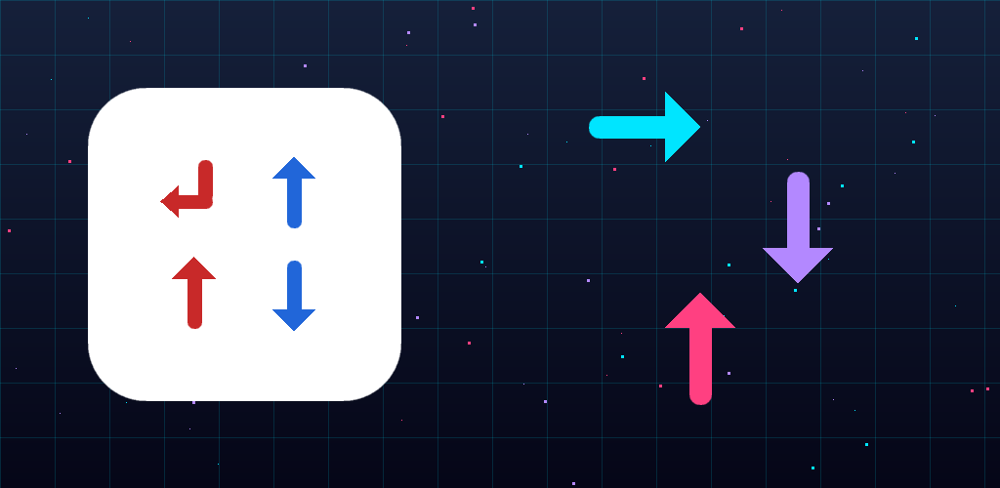

# Arrow Puzzle

A relaxing tap-away logic puzzle for Android. Built with Flutter.



## Gameplay

Tap arrows to clear them from the grid — but only if their forward path is clear. Plan the order, clear every arrow, breathe out.

## What's inside

- **60 hand-curated levels**, easy → boss difficulty (all solver-validated)
- **Timer Attack mode** — 60s of procedural puzzles
- **Daily Challenge** — same puzzle for everyone, every day
- **Hint system**, three-star rating, move-count tracking
- **Local notifications**, share intents, dark+light themes
- **Fully offline**, no ads (v1), no data collection

## Tech

- Flutter 3.44+ with Riverpod 3 state management
- Pure-Dart engine + DFS solver with memoization
- Custom `CustomPainter` for everything (no Flame engine)
- Procedural levels via reverse-solve construction (guaranteed solvable)
- `flutter_local_notifications`, `audioplayers`, `share_plus`, `google_fonts`

## Run locally

```bash
flutter pub get
flutter run -d <device-id>
```

## Build for Play Store

```bash
# Sound + icon assets are generated programmatically:
dart run tool/gen_sounds.dart
dart run tool/gen_icon.dart
dart run flutter_launcher_icons
dart run flutter_native_splash:create

# Validate every level is solvable:
dart run tool/validate_levels.dart

# Build signed AAB (requires android/key.properties):
flutter build appbundle --release
```

Output: `build/app/outputs/bundle/release/app-release.aab`

## Project layout

```
lib/
├── main.dart
├── models/        — Direction, Arrow, Grid, Level, GameState (immutable)
├── engine/        — Solver (canEscape, isSolvable, findSolution)
├── services/      — Riverpod providers + persistence
├── screens/       — Menu, Game, LevelSelect, Daily, Timer, Settings
├── widgets/       — ArrowCell, GridBoard, HeartBar, HintButton, ...
└── theme/         — Neon cyber palette + Orbitron/Rajdhani fonts

assets/
├── levels/        — 60 hand-curated JSON puzzles + index
├── sounds/        — Procedurally generated WAVs
└── icons/         — Source PNGs for launcher_icons

tool/              — One-off generators (sounds, icons, levels, banner)
store_assets/      — Play Store-ready images + descriptions
```

## Tests

```bash
flutter test
```
62 tests covering the engine, game state machine, progress + daily services.

## License

All rights reserved.
